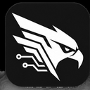

<div align="center">

# NetHawk



### Основано на

[**Flowseal/zapret-discord-youtube**](https://github.com/Flowseal/zapret-discord-youtube) · [**bol-van/zapret**](https://github.com/bol-van/zapret)


</div>

> [!CAUTION]
> ### Поддельные сборки и страницы
>
> **Официальный источник NetHawk — этот GitHub-репозиторий и его раздел Releases.**
>
> Репозиторий: [**Inject0r77/NetHawk**](https://github.com/Inject0r77/NetHawk)  
> Релизы: [**github.com/Inject0r77/NetHawk/releases**](https://github.com/Inject0r77/NetHawk/releases)
>
> Если архив, страница, Telegram-/YouTube-канал или другая публикация с названием NetHawk не указаны в этом репозитории, **не считайте их официальными автоматически**. Перед запуском сторонней сборки проверяйте источник и содержимое архива.

> [!IMPORTANT]
> ### Откуда берутся файлы в `bin`
>
> NetHawk **не выдаёт `winws`, WinDivert и сторонние payload-файлы за собственную разработку**.
>
> В текущей ветке 0.3.x профили, списки и бинарные ресурсы синхронизируются из зафиксированной ревизии [**Flowseal/zapret-discord-youtube**](https://github.com/Flowseal/zapret-discord-youtube), который использует runtime из [**bol-van/zapret-win-bundle**](https://github.com/bol-van/zapret-win-bundle/tree/master/zapret-winws) и [**bol-van/zapret releases**](https://github.com/bol-van/zapret/releases).
>
> NetHawk не пересобирает эти runtime-файлы при создании релиза. При желании их можно сверить с upstream по контрольным суммам. Точная закреплённая ревизия Flowseal указана ниже в разделе «Закреплённая синхронизация upstream».

> [!WARNING]
> ### Антивирусы и WinDivert
>
> **WinDivert может вызвать срабатывание антивируса или попасть в карантин.** Это драйвер/библиотека для перехвата и фильтрации сетевого трафика, необходимая для работы Windows-runtime `zapret`.
>
> Некоторые продукты безопасности классифицируют такие инструменты как PUA/RiskTool и могут показывать названия, содержащие `WinDivert` или, например, `Not-a-virus:RiskTool.Multi.WinDivert`.
>
> Если антивирус удалил компонент, сначала убедитесь, что архив получен из официального репозитория NetHawk, и при необходимости сравните файлы с upstream. Если вы понимаете последствия и доверяете проверенной сборке, безопаснее добавить **конкретную папку NetHawk** в исключения, чем полностью отключать защиту системы.
>
> Подробнее об особенностях WinDivert у upstream: [**zapret-win-bundle — антивирусы**](https://github.com/bol-van/zapret-win-bundle/blob/master/readme.md#антивирусы).

> [!IMPORTANT]
> **NetHawk — независимый производный проект.**
>
> Он основан на и адаптирует наработки [**Flowseal/zapret-discord-youtube**](https://github.com/Flowseal/zapret-discord-youtube), который, в свою очередь, построен вокруг [**bol-van/zapret**](https://github.com/bol-van/zapret) и его Windows-runtime `winws`.
>
> Перехват и фильтрация пакетов в Windows выполняются через **WinDivert**.
>
> NetHawk не является официальной сборкой Flowseal или bol-van.

## Происхождение проекта

```text
NetHawk
└── основан на Flowseal/zapret-discord-youtube
    └── построен вокруг bol-van/zapret + zapret-win-bundle
        └── фильтрация пакетов в Windows через WinDivert
```

### Upstream-проекты

- [**Flowseal/zapret-discord-youtube**](https://github.com/Flowseal/zapret-discord-youtube) — стратегии, списки, fake-payload'ы и часть Windows-логики, адаптированной в NetHawk.
- [**bol-van/zapret**](https://github.com/bol-van/zapret) — основной движок DPI-desync и `winws`.
- [**bol-van/zapret-win-bundle**](https://github.com/bol-van/zapret-win-bundle) — Windows runtime и упаковка компонентов.
- [**Basil00/WinDivert**](https://github.com/basil00/WinDivert) — драйвер и библиотека для перехвата/фильтрации сетевого трафика в Windows.

Полная информация о сторонних компонентах и лицензиях находится в [THIRD_PARTY.md](THIRD_PARTY.md) и [LICENSE-THIRD-PARTY.txt](LICENSE-THIRD-PARTY.txt).

---

## Что добавляет NetHawk

NetHawk не выдаёт `winws`, DPI-техники или стратегии Flowseal за собственные разработки. Наш проект добавляет отдельный слой управления поверх них.

| Слой | Источник |
|---|---|
| `winws`, DPI-desync механики | bol-van/zapret |
| WinDivert runtime | Basil00/WinDivert |
| Базовые стратегии, hostlist, IPSet и fake payloads | Flowseal/zapret-discord-youtube, с сохранением attribution |
| Парсер профилей и единый генератор аргументов | **NetHawk** |
| Одинаковая стратегия для ручного запуска и Windows-службы | **NetHawk** |
| Закреплённая синхронизация upstream-ресурсов | **NetHawk** |
| Windows CI с проверкой launchers и всех профилей | **NetHawk** |
| Пользовательские overrides и дополнительные TCP/UDP порты | **NetHawk** |
| Адаптивный тестер стратегий | **в планах NetHawk** |

Главное архитектурное отличие — upstream BAT-стратегии используются как **данные профиля**, а не исполняются как большие CMD-скрипты.

```text
профиль
   ↓
парсер NetHawk
   ↓
итоговые аргументы winws
   ├── ручной запуск
   ├── Windows-служба
   ├── тестер
   └── self-test
```

Это позволяет держать единственный источник истины для каждой стратегии.

---

## Быстрый старт

1. Распакуйте релиз в обычную локальную папку.
2. Запустите **`NetHawk.bat`**.
3. Выберите стратегию.
4. Подтвердите запрос прав администратора.
5. Если выбранная стратегия не работает в вашей сети — попробуйте другую.

Для автозапуска, службы и расширенных настроек используйте **`service.bat`**.

> [!NOTE]
> Универсальной стратегии не существует. Результат зависит от провайдера, маршрута, текущей конфигурации DPI/ТСПУ и конкретного сервиса.

---

## Профили

Текущая dev-линия поддерживает:

- **General**
- **ALT1–ALT12**
- **EXP**
- **FAKE TLS AUTO**, включая ALT1–ALT3
- **SIMPLE FAKE**, включая ALT1–ALT2

Закреплённые upstream-профили синхронизируются из конкретного commit Flowseal и хранятся в `profiles/`.

Пользовательские BAT-launcher'ы специально остаются минимальными:

```text
general (ALT7).bat
        ↓
scripts/NetHawk.ps1
        ↓
profiles/ALT7.profile
        ↓
winws.exe
```

Большая стратегия больше не исполняется через `cmd.exe`.

---

## Свои порты, Profile Overrides и Port Scout

NetHawk позволяет расширять рабочую upstream-стратегию без редактирования большого BAT-файла.

### Глобальные TCP/UDP порты

В главном меню можно добавить собственные порты, например:

```text
TCP: 6695
UDP: 4950,4955,27000-27100
```

Они сохраняются в `config/ports-user.json` и автоматически подмешиваются в `%GameFilterTCP%` / `%GameFilterUDP%` выбранной стратегии. То есть порт попадает не только в общий WinDivert capture filter, но и в отдельный GameFilter-блок стратегии с обработкой произвольного протокола.

Обновление upstream-профилей эти настройки не затирает.

### Пользовательские профили

Можно создать собственный профиль поверх любого штатного:

```text
Warframe
├── Base: ALT7
├── TCP +: 6695
├── UDP +: 4950,4955
└── Raw Extra Arguments: ...
```

NetHawk не копирует весь ALT7. В `config/profiles-user/` хранится только override: базовый профиль и отличия от него. Поэтому upstream-стратегию можно обновить отдельно, а пользовательские настройки останутся на месте.

Для опытных пользователей есть **Raw Extra Arguments**. Они дописываются в конец итоговой команды `winws`; если нужен новый strategy block, `--new` указывается вручную.

> [!NOTE]
> Если пользовательский профиль уже установлен как Windows-служба, после изменения его override или глобальных TCP/UDP-портов установите профиль как службу заново. Windows Service хранит уже развёрнутую командную строку `winws`, поэтому существующая служба сама не перечитает JSON-настройки.

### Port Scout

Port Scout наблюдает за сетевой активностью выбранного процесса от 5 до 300 секунд.

Он собирает:

- **TCP remote ports** — удалённые TCP-порты процесса;
- **UDP local ports** — локальные UDP endpoint-порты процесса.

Для Windows это пригодно для `winws`, потому что `--wf-tcp` и `--wf-udp` строят фильтры одновременно по source и destination port.

После сканирования найденные порты можно:

- добавить глобально;
- превратить в новый пользовательский профиль поверх выбранной стратегии;
- добавить в уже существующий пользовательский профиль;
- просто сохранить в лог.

Port Scout автоматически отбрасывает порты, которые уже покрывает выбранный профиль, чтобы не плодить бессмысленные дубли.

Логи:

```text
logs/
└── port-scout/
    ├── latest.txt
    └── runs/
        └── YYYY-MM-DD_HH-mm-ss-ProcessName.txt
```

---
## Менеджер службы

`service.bat` предоставляет единое меню управления:

| Функция | Назначение |
|---|---|
| Установить профиль как службу | Автоматический запуск выбранной стратегии вместе с Windows |
| Удалить службу | Удалить службу NetHawk и остановить текущий `winws` |
| Статус | Состояние службы и процесса |
| Game Filter | `off` / TCP+UDP / TCP / UDP |
| IPSet Filter | `loaded` / `none` / `any` |
| Discord fake | Выбор fake-payload для Discord UDP |
| Game fake | Выбор fake-payload для игрового/прочего UDP |
| Sync resources | Пересинхронизация закреплённых профилей, списков и bin |
| Update IPSet | Отдельное обновление IPSet |
| Diagnostics | Проверка типичных конфликтов и проблем окружения |
| Tester | Проверка стратегий |

Старая dev-служба `DPIBypass` считается legacy и может быть обнаружена/удалена при миграции.

---

## Списки и IPSet

```text
lists/
├── list-general.txt
├── list-general-user.txt
├── list-google.txt
├── list-exclude.txt
├── list-exclude-user.txt
├── ipset-all.txt
├── ipset-all.txt.backup
├── ipset-exclude.txt
├── ipset-exclude-user.txt
├── ipset-none.txt
└── ipset-any.txt
```

Пользовательские файлы отделены от синхронизируемых upstream-данных, чтобы обновления не затирали личные изменения.

---

## Бинарные payload'ы

Релиз уже содержит Windows-runtime и необходимые QUIC/TLS/STUN fake-payload'ы.

```text
bin/
├── winws.exe
├── WinDivert.dll
├── WinDivert64.sys
├── cygwin1.dll
├── ACTIVE_DISCORD_UDP.bin
├── ACTIVE_GAME_UDP.bin
├── quic_initial_*.bin
├── tls_clienthello_*.bin
└── stun*.bin
```

Эти компоненты остаются сторонними и сохраняют attribution соответствующих upstream-проектов.

---

## Закреплённая синхронизация upstream

Текущая база профилей и ресурсов закреплена на:

```text
Flowseal/zapret-discord-youtube
commit 249a70424aae2676f99c5363e21073ed89873eda
```

`tools\sync-resources.bat` восстанавливает синхронизируемые ресурсы именно из этой ревизии.

Поэтому уже выпущенная версия NetHawk не изменится сама по себе, если Flowseal позже обновит `main`.

Обновление IPSet вынесено отдельно и при необходимости может использовать более свежий список.

---

## Тестер профилей

`tester.bat` теперь содержит два полноценных режима проверки и визуально придерживается той же удобной консольной палитры, что и референс Flowseal: cyan для секций/инфо, зелёный для успешных проверок, жёлтый для предупреждений и unsupported, красный для ошибок и признаков блокировки.

### Стандартные тесты

Для каждого выбранного профиля параллельно проверяются:

- Discord Main / Gateway / CDN / Updates;
- YouTube Web / Short / Image / Video Redirect;
- Google Main / Gstatic;
- Cloudflare Web / CDN;
- публичные DNS-адреса через ping.

Для HTTPS targets выводятся отдельные результаты:

```text
HTTP     TLS1.2     TLS1.3     Ping
```

Можно прогнать все профили или выбрать только нужные номерами/диапазонами.

### DPI checker — TCP 16–20 KB

Отдельный режим использует target suite проекта [hyperion-cs/dpi-checkers](https://github.com/hyperion-cs/dpi-checkers) и проверяет HTTP / TLS 1.2 / TLS 1.3 на паттерн TCP 16–20 KB freeze.

Для каждой точки выводятся объёмы upload/download, время ответа и статус:

```text
OK
FAIL
UNSUPPORTED
LIKELY_BLOCKED
```

Перед DPI-тестом NetHawk временно переключает **свой IPSetMode** в `any`, а после теста восстанавливает исходную настройку. Если окно было аварийно закрыто, recovery-backup восстанавливается при следующем запуске тестера.

### Итоги и логи

После прогона NetHawk показывает сводку по каждому профилю и список стратегий, которые предпочтительно проверить дальше.

Для стандартного режима приоритет — больше успешных HTTP/TLS-проверок и меньше ошибок. Для DPI checker — сначала меньше `BLOCKED`, затем больше `OK` и меньше `FAIL`.

Результаты сохраняются в:

```text
logs/
└── tester/
    ├── latest.txt
    ├── latest.csv
    └── runs/
        └── test_results_YYYY-MM-DD_HH-mm-ss.txt
```

При запуске через `tester.bat` консоль остаётся открытой до действия пользователя. Установленная служба NetHawk (и legacy-служба DPIBypass, если она ещё осталась) на время теста останавливается и после завершения восстанавливается.

---

## Проверка релизов

Перед созданием релиза GitHub Actions запускается на настоящем Windows runner и проверяет:

- синтаксис PowerShell;
- синхронизацию закреплённых ресурсов;
- ASCII + CRLF у пользовательских BAT-launcher'ов;
- запуск `status.bat` через настоящий `cmd.exe`;
- разбор всех профилей;
- отсутствие неразвёрнутых переменных;
- наличие всех используемых `.bin` и `.txt`.

Если проверка падает — релиз не создаётся.

---

## Архитектура

```text
NetHawk.bat / general*.bat / service.bat
                    │
                    ▼
             scripts/NetHawk.ps1
                    │
          ┌─────────┼──────────┐
          ▼         ▼          ▼
      profiles/   lists/      config/
          │         │          │
          └─────────┼──────────┘
                    ▼
                 winws.exe
                    │
                    ▼
             WinDivert driver
```

Подробнее: [docs/ARCHITECTURE.md](docs/ARCHITECTURE.md).

---

## В планах

Следующий собственный слой NetHawk должен сохранить удобство ручной настройки Flowseal, но убрать необходимость редактировать огромные BAT-файлы:

- **Adaptive Tester** — автоматический прогон стратегий и создание пользовательского профиля по результатам;
- **Composite Profile Builder** — разные стратегии для разных классов трафика внутри одного пользовательского профиля;
- **Network Fingerprints** — разные рабочие профили для разных сетей.

Цель — сохранить свободу ручной настройки стратегии, но сделать изменения постоянными, прозрачными и устойчивыми к обновлениям.

---

## Авторы, upstream и лицензии

**inject0r77** — разработчик NetHawk и его собственного слоя управления профилями, настройками и тестированием.

NetHawk существует благодаря работе upstream-разработчиков.

**bol-van** — автор и основной разработчик `zapret`, включая DPI-desync механики и `winws`, используемые NetHawk.

**Flowseal** — разработчик `zapret-discord-youtube`, чьи Windows-стратегии, списки, payload-ресурсы и практические решения являются важной upstream-базой NetHawk.

**Basil00** — разработчик WinDivert, который используется Windows-runtime для перехвата сетевых пакетов.

Собственный код NetHawk распространяется под [MIT License](LICENSE).

```text
Copyright (c) 2026 inject0r77
Copyright (c) 2016-2026 bol-van
Copyright (c) 2024-2026 Flowseal
```

Строка inject0r77 относится к собственным дополнениям NetHawk. Сторонние компоненты сохраняют свои лицензии и уведомления об авторских правах: [THIRD_PARTY.md](THIRD_PARTY.md), [LICENSE-THIRD-PARTY.txt](LICENSE-THIRD-PARTY.txt).


---

## Разработка

Техническое состояние проекта: [`docs/DEVELOPMENT.md`](docs/DEVELOPMENT.md). Планы: [`docs/ROADMAP.md`](docs/ROADMAP.md). Архитектура: [`docs/ARCHITECTURE.md`](docs/ARCHITECTURE.md). Визуальное направление: [`docs/BRAND.md`](docs/BRAND.md).
